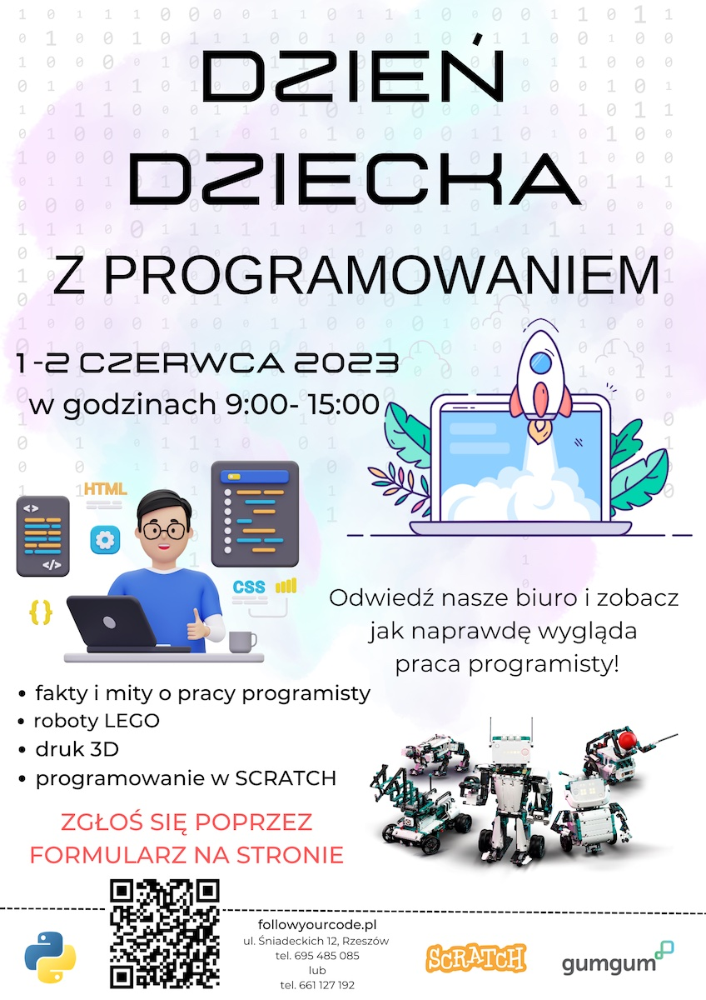

+++
author = "Łukasz Kobylski"
title = "Dzień dziecka z programowaniem"
date = "2023-04-17"
description = "Zapraszamy na dzień dziecka z programowaniem"
tags = [
    "dziendziecka", "programowanie", "nauka", "dzienotwarty"
]
draft = true
+++

# Dzień dziecka z programowaniem

Mamy ogromną przyjemność zaprosić Was na "Dzień dziecka z programowaniem" - pierwsze wydarzenie zorganizowane przez FollowYourCode! To wyjątkowa okazja dla dzieci i młodzieży, aby zapoznać się z programowaniem, robotyką i nowymi technologiami. Zapraszamy szkoły podstawowe na 1 lub 2 czerwca do odwiedzenia naszego biura, gdzie przygotowaliśmy wiele niespodzianek i atrakcji.

W ciągu dwóch dni "Dnia dziecka z programowaniem" przeprowadzimy wiele ciekawych i interaktywnych warsztatów, które pomogą dzieciom poznać podstawy programowania oraz umożliwią im tworzenie swoich pierwszych projektów. Będziemy mieć dla was wiele ciekawych zabaw i konkursów. Oczywiście nie zabraknie też możliwości zobaczenia, jak wygląda praca programisty na co dzień, a także zobaczenia, jak działają najnowsze technologie oraz posluchać historii programowania.

{#dzien-dziecka-plakat .text-center}

Cieszymy się, że możemy zaprosić Was na to wyjątkowe wydarzenie, które ma na celu propagowanie zainteresowania programowaniem i zachęcanie dzieci do nauki nowych technologii. Jesteśmy przekonani, że nasze wydaenie będzie świetną okazją do nauki i zabawy oraz umożliwi dzieciom odkrycie nowych talentów.

Zapraszamy wszystkich chętnych do odwiedzenia naszego biura w dniach 1 i 2 czerwca, aby razem spędzić czas i poznać tajniki programowania. To niepowtarzalna okazja, aby zacząć swoją przygodę z nowymi technologiami i poszerzyć swoje horyzonty.

Liczba miejsc jest ograniczona dlatego prosimy szkoły o wysyłanie zgłoszeń wzięcia udziała w dniu dziecka poprzez [formularz](/formularz.html) na naszej stronie.

Czekamy na Was!
